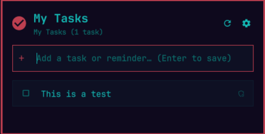

# Google Tasks for Omarchy

[](https://omarchyplugins.com)
[](LICENSE)

A lightweight, keyboard-friendly **Google Tasks & Reminders** bar widget and panel for the Omarchy Quattro shell.

View your task lists, toggle checkboxes to complete tasks in real-time, see overdue/today indicators, and quick-add new reminders directly from the Omarchy top bar.

<p align="center">
  
  <br />
  <em>Interactive Tasks Panel &amp; Bar Widget Indicator</em>
</p>

---

## ✨ Features

- **⚡ Zero External Dependencies:** Pure Python 3 standard library backend (no broken `pip` or virtualenv issues on Arch).
- **📋 Live Sync with Google Tasks:** Instant checklist synchronization with your Google Tasks and Google Calendar.
- **🏷️ Task List Switching:** Seamlessly switch between different task lists (*"My Tasks"*, *"Reminders"*, *"Work"*, *"Errands"*).
- **⏱️ Smart Due Date Highlights:** Highlights tasks that are **Overdue** (red/urgent) or **Due Today** (accent).
- **➕ Quick Add:** Type any task or reminder and press `Enter` to create it instantly.
- **🔒 Private & Secure:** Your credentials and OAuth tokens stay 100% local on your machine with restricted permissions (`0600`).

---

## 🚀 Setup & Authentication Guide

Because Google Tasks contains personal data, each user connects using their own free Google Cloud OAuth Client.

### Step 1: Create your Google Cloud OAuth Client (2 minutes)

1. Open the [Google Cloud Console](https://console.cloud.google.com/).
2. Create a new project (e.g. `Omarchy Tasks`) or select an existing one.
3. Enable the **Google Tasks API**:
   - Navigate to **APIs & Services** → **Library** (or search for `Google Tasks API` in the top search bar).
   - Click **Enable**.
4. Configure the **Google Auth Platform**:
   - In the left sidebar, navigate to **Google Auth Platform** (or **APIs & Services** → **OAuth consent screen**).
   - **Branding tab**: Set an App name (e.g. `Omarchy Tasks`) and your email address.
   - **Audience tab** *(Crucial Step)*:
     - Under **User type**, ensure it is set to **External**.
     - Under **Test users**, click **+ Add users** and enter your Google email address (`yourname@gmail.com`).
     > **Note:** While the app is in testing status, Google requires your email to be added under **Audience → Test users**, otherwise login will be blocked.
5. Create your **Desktop Client ID**:
   - In the left sidebar of Google Auth Platform, click **Clients** (or go to **APIs & Services** → **Credentials**).
   - Click **+ Create Client** (or **Create Credentials** → **OAuth client ID**).
   - Select Application type: **Desktop app**.
   - Name: `Omarchy Tasks Desktop`.
   - Click **Create**.
6. Copy your **Client ID** and **Client Secret**.

---

### Step 2: Connect the Plugin

1. Open the **Google Tasks** panel from your Omarchy top bar (or click the Settings ⚙️ gear icon).
2. Paste your **Client ID** and **Client Secret**.
3. Click **Sign In with Google**.
4. A browser window will open asking you to sign in with your Google account and grant access to Google Tasks.
5. Click **Allow** (or proceed past the testing warning if shown). Once the success page appears, your tasks will sync immediately!

*(Alternative: You can also place your downloaded `client_secret.json` directly inside `~/.config/omarchy/plugins/cjkaufman.google-tasks/client_secret.json`)*.

---

## 📦 Installation

### Option 1: Via Omarchy CLI (Recommended)

```bash
omarchy plugin add https://github.com/cjkaufman/omarchy-google-tasks
```

### Option 2: Manual Clone

```bash
git clone https://github.com/cjkaufman/omarchy-google-tasks ~/.config/omarchy/plugins/cjkaufman.google-tasks
omarchy-shell shell rescanPlugins
```

### Add to the Top Bar

```bash
omarchy bar put cjkaufman.google-tasks --section right
```

---

## ⚙️ Configuration Options

You can adjust plugin options in `~/.config/omarchy/shell.json` or via `omarchy bar set`:

| Setting | Default | Description |
| :--- | :--- | :--- |
| `targetListName` | `"My Tasks"` | Name of the task list to sync by default. |
| `refreshIntervalSec` | `120` | Interval in seconds between background syncs. |
| `showCompleted` | `false` | Whether to display completed tasks in the list. |
| `countMode` | `"all"` | Bar badge count mode: `"all"` (all open tasks), `"due"` (today/overdue only), or `"none"`. |

---

## ⌨️ Keybindings in Panel

- `a`: Focus the quick-add input field.
- `r`: Force sync tasks from Google.
- `Esc`: Close the panel.

---

## 🛡️ Privacy & Security

- **No Remote Servers:** This plugin communicates directly and exclusively with official Google APIs (`https://tasks.googleapis.com` and `https://oauth2.googleapis.com`).
- **Local Credential Storage:** Tokens and client configurations are saved in `~/.config/omarchy/plugins/cjkaufman.google-tasks/` with `0600` permissions (readable only by your user).
- **Open Source:** Full source code is available in this repository under the MIT License.

---

## 📄 License

MIT License © 2026 Carl Kaufman
